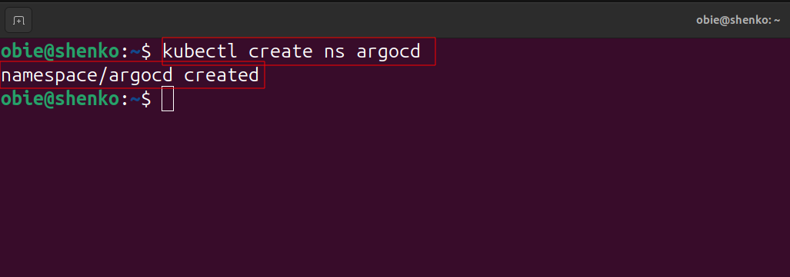
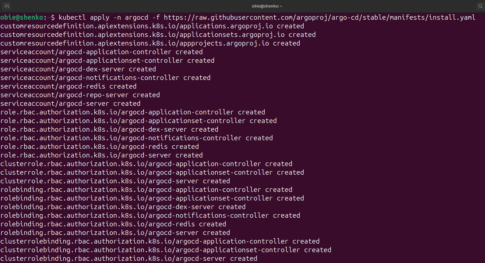
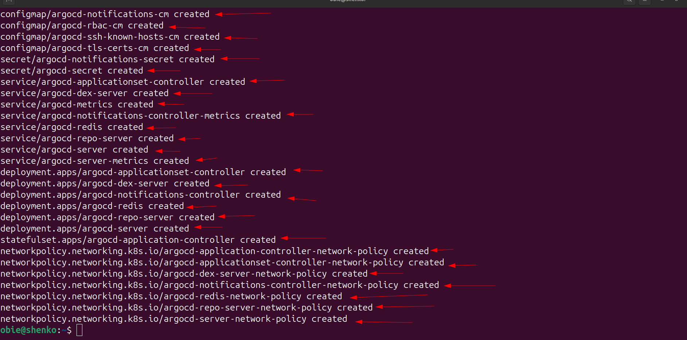
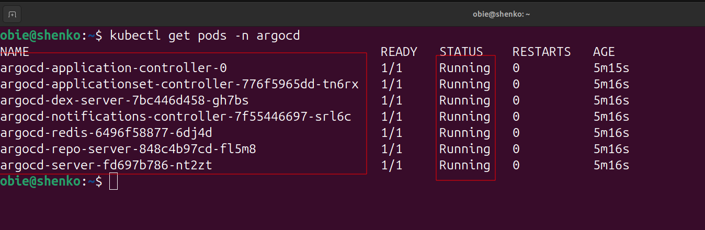
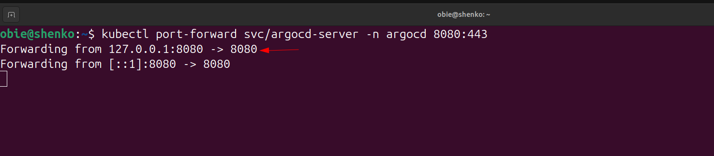
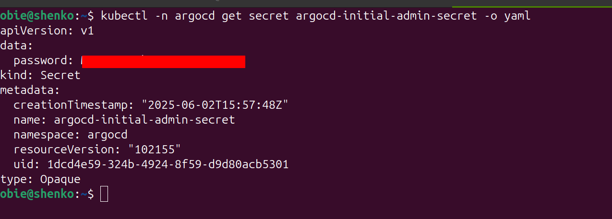
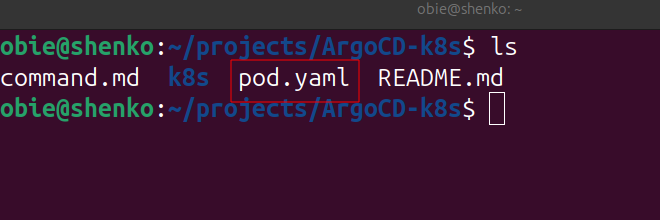

# ArgoCD with kubernetes
## This project demonstrates how to use argoCD and k8s

## Make sure you have a kubenrnte tool ready to work with 
## For this project i choose minkune a single node cluster but for minkube to work there must be docker deskstop running on ur system

# create a prpject folder 
 `mkdir argocd-deployment-kubenrnetes`

 `cd argocd-deployment-kubenrnetes`
 
# start your minkube by running the command below
`minikube start`

# the command above get ur two node cluster ready coipled with the kubernetes cli interface call kubectl

# now run the command below

`minikube status`

* minikube type: Control Plan
* minikube-m02 type: Worker

# Create Namespace
`kubectl create ns argocd`

# Install ArgoCD on k8s cluster

`kubectl apply -n argocd -f https://raw.githubusercontent.com/argoproj/argo-cd/stable/manifests/install.yaml`

# Get pods in argocd namespace
kubectl get pods -n argocd

# Get service in argocd namespace
`kubectl get svc -n argocd`

# Map port
`kubectl port-forward svc/argocd-server -n argocd 8080:443`

# Run below on new terminal
`kubectl -n argocd get secret argocd-initial-admin-secret -o yaml`

`kubectl -n argocd get secret argocd-initial-admin-secret -o jsonpath="{.data.password}" | base64 -d`

# Run the cmd below to create a new file for a new pod & observe argoCD detect and sync changes
`kubectl run web1  --image=nginx --dry-run=client -o yaml > pod.yaml`

